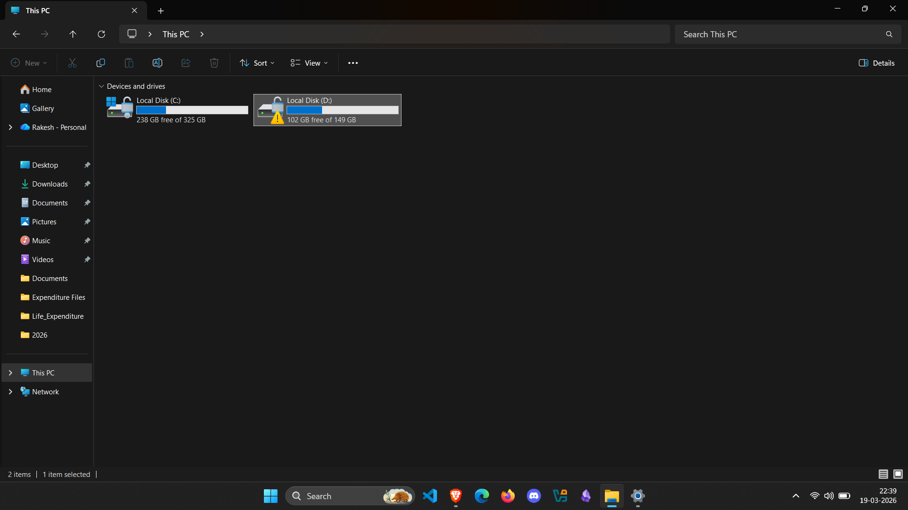
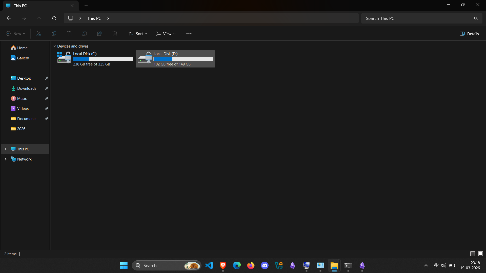
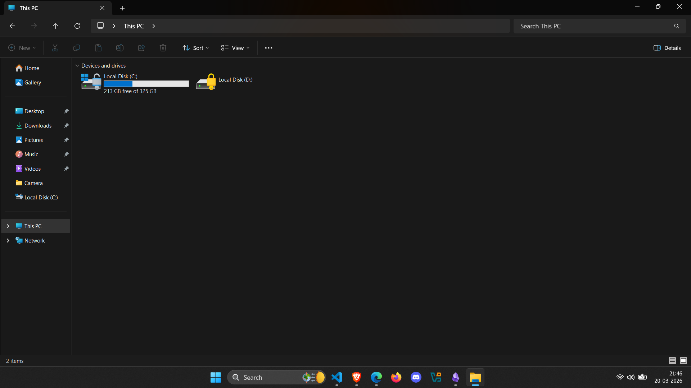

# Table of content

- [Device Encryption Suspended](#device-encryption-suspended)
- [Turn on auto unlock drive](#turn-on-auto-unlock-drive)

---
# Device Encryption Suspended


## Solution :book:

- **Step 1:** Turn off encryption by following command prompt
```c
manage-bde D: -off
```

> `D:` is drive name. Replace my drive letter with yours.

- **Step 2:** Turn on encryption by following command prompt
```c
manage-bde D: -on
```


---

# Turn on auto unlock drive



- **Step 1:** Visit [ Microsoft Account ]([Microsoft account | BitLocker recovery keys](https://account.microsoft.com/devices/recoverykey?refd=account.microsoft.com))
- **Step 2:** Log in your Microsoft account
- **Step 3:** Copy your **Recovery Key** and double click your **D drive** and paste **Recovery key** to unlock it.
- **Step 4:** Open **Command Prompt** as **Administrator**
- **Step 5:** Type following command in **Command Prompt**
```python
manage-bde -autounlock -enable D:
```
> Replace my drive letter with yours.

After above command you will see following command:

```python
Microsoft Windows [Version 10.0.26200.8037]
(c) Microsoft Corporation. All rights reserved.

C:\Windows\System32>manage-bde -autounlock -enable D:
BitLocker Drive Encryption: Configuration Tool version 10.0.26100
Copyright (C) 2013 Microsoft Corporation. All rights reserved.

Key Protectors Added:
    External Key:
      ID: {4BB89AC4-C100-4214-A5DD-8FE1FC905CC7}
      External Key File Name:
        4BB89AC4-C100-4214-A5DD-8FE1FC905CC7.BEK
      Automatic unlock enabled.
C:\Windows\System32>
```
You have successfully solved your problem, congratulations! Now this problem will never occurer even if you restart your device everyday.